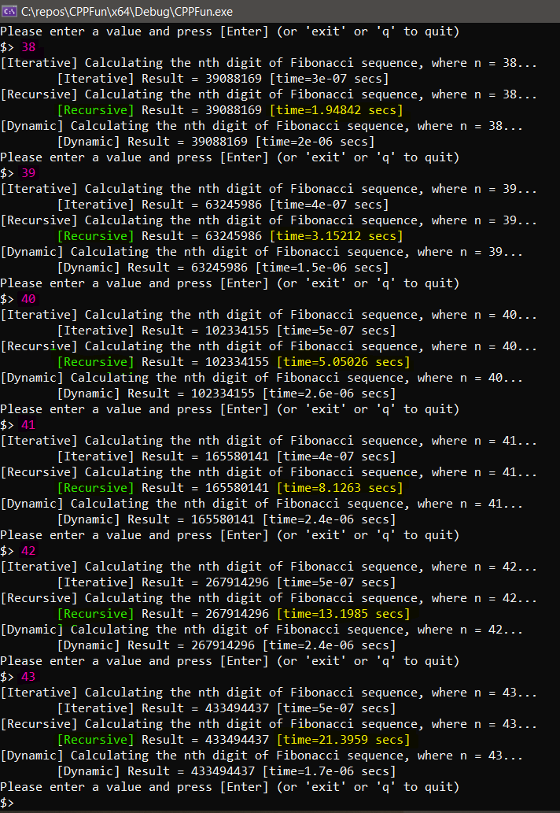

# CPPFun

## Setup

Coming soon

## Generating An Executable Manually

1. Launch CMD as administrator
2. Navigate to project root (`./CPPFun/`)
3. Run `createExe.cmd`

## Running

Run the executable generated by the above command, or the one that exists in the repository, named `CPPFun.exe` (Should be the same thing, one is just freshly created)

### Notes

* I have run the application and tested up to the 44th digit successfully. Interestingly enough, the recursive solution appears to increase in run time following the fibonacci sequence itself:

#### Author / Copyright

© Anthony Williams 2018 - 2019
